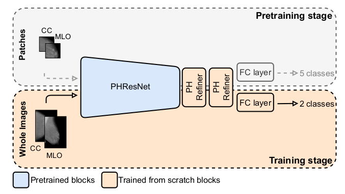
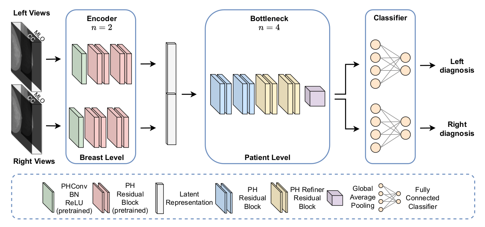
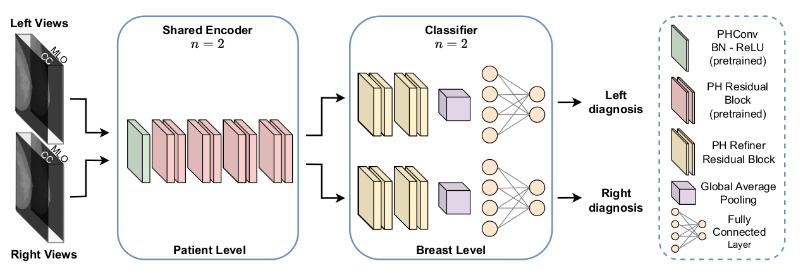

# PHBreast - Multi-View Breast Cancer Classification

## Description

A novel approach for multi-view breast cancer
classification based on parameterized hypercomplex neural net-
works. This method uses multi-views mammography exams, owing to the correlations contained in mammography views, which present crucial information for identifying tumors.

Reference: https://arxiv.org/abs/2204.05798

- Target: `Lesions` (masses, calcifications, asymmetries, and distortions)
- Task: Classification (Normal/Benign, Malignant)
- Modality: Image (Grayscale)

## Models Architectures

### PHRCResNets

### PHYBONet

### PHSENet

## Dataset

- CBIS-DDSM

  - Source: [cancerimagearchive](https://wiki.cancerimagingarchive.net/pages/viewpage.action?pageId=22516629)
  - Pre-processed data can be downloaded from [ispamm/PHBreast](https://github.com/ispamm/PHBreast#data-open_file_folder)
  - Format: List\[Tuple(Tensor, int)\] stored as torch pt file.

- INBreast

  - Source: [pubmed-ncbi](https://pubmed.ncbi.nlm.nih.gov/22078258/)
  - Pre-processed data can be downloaded from [ispamm/PHBreast](https://github.com/ispamm/PHBreast#data-open_file_folder)
  - Format: List\[Tuple(Tensor, int)\] stored as torch pt file.

- VINDR

  - Source: [vindr.ai](https://vindr.ai/datasets/mammo)
  - Format: Stored as [FiftyOneDataset](https://docs.voxel51.com/user_guide/using_datasets.html) format.

## Training Process

## Results
